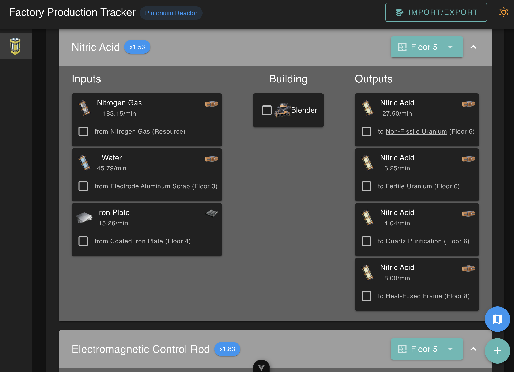
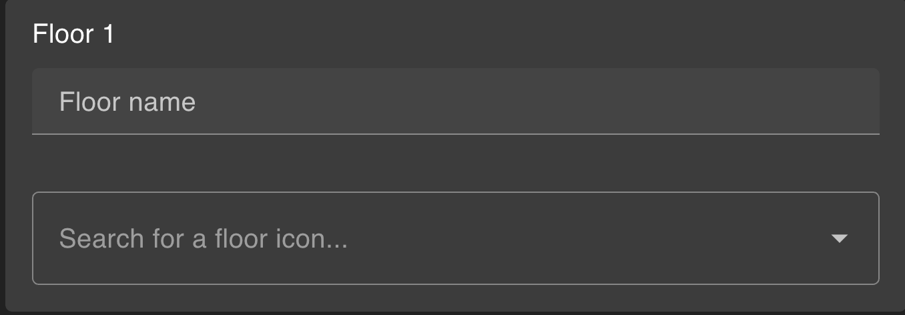
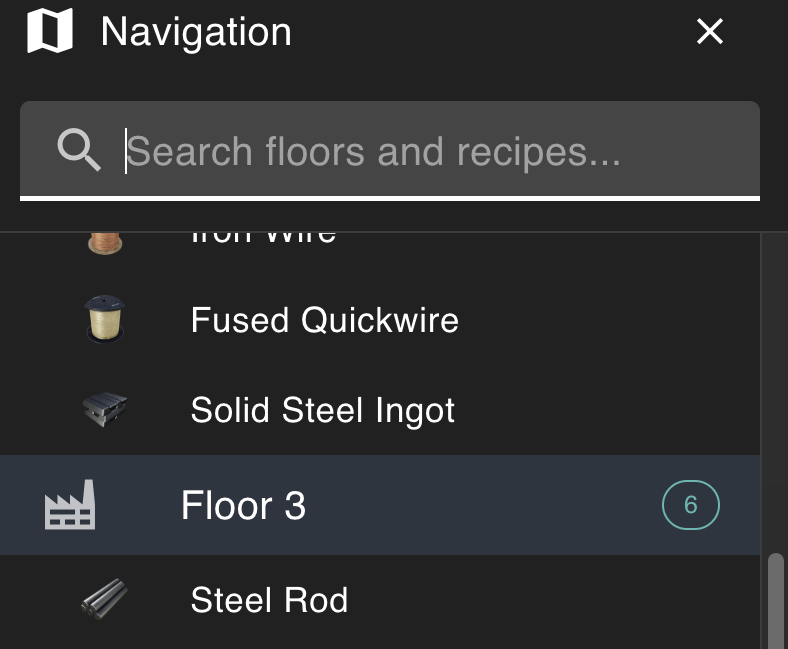
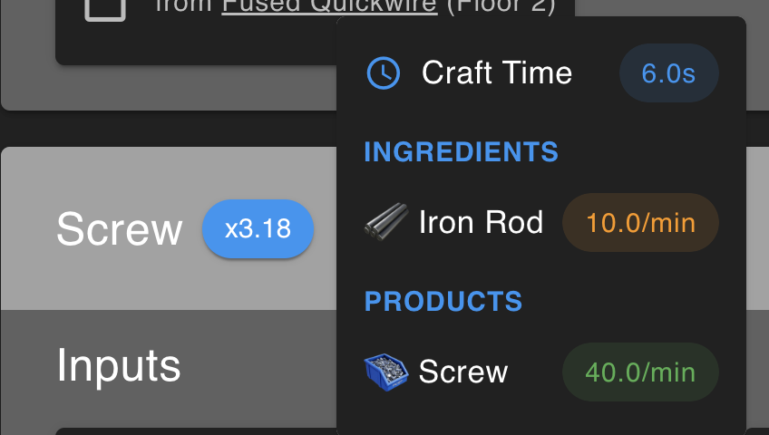
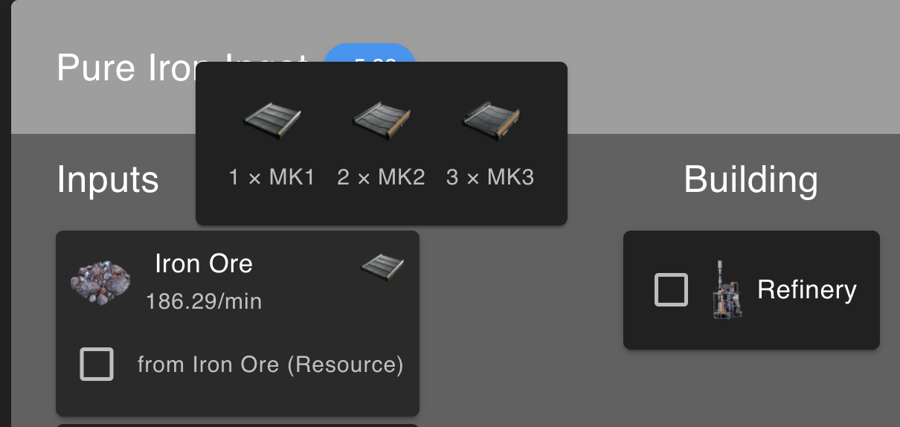
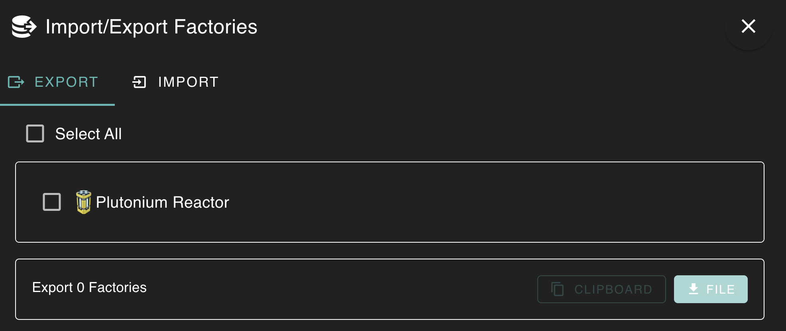
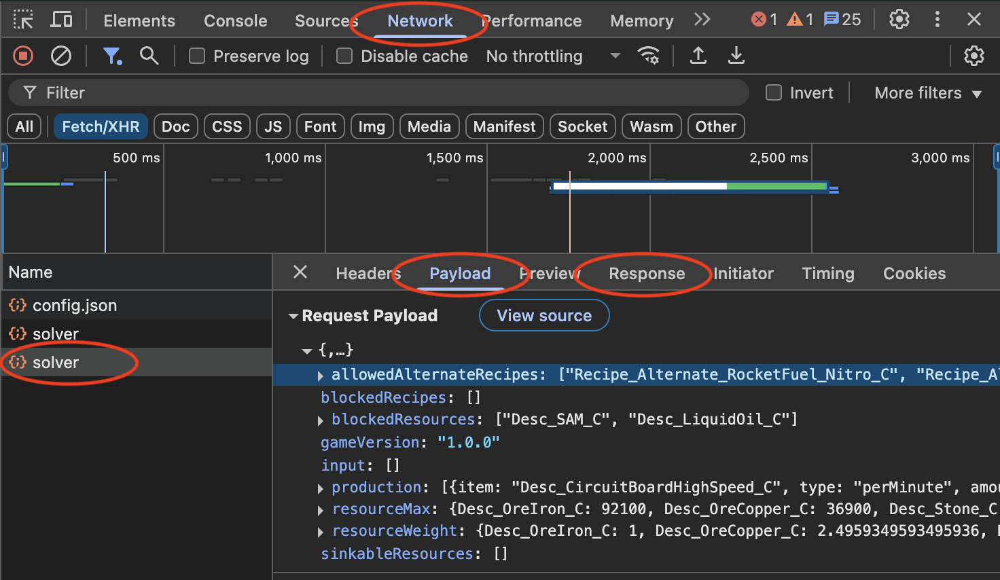
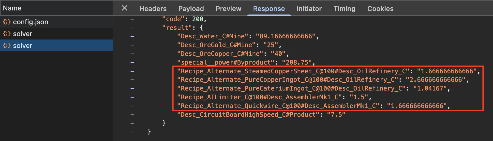

# Satisfactory Production Tracker

**Stop losing track of factory connections.**

Ever build a massive factory only to discover you're missing one crucial ingredient connection at the end?
This production tracker solves the problem that existing Satisfactory tools ignore: **tracking the links between your factories**, not just what you're building.

Unlike other production planners that focus on recipes and ratios, this tool visualizes your entire supply chain as an interconnected network.
See exactly where each input comes from and where each output goes - across multiple factory floors - so you never miss a connection again.

This project draws inspiration from [Satisfactory Tools](https://www.satisfactorytools.com/1.0/production) and [Satisfactory Production Planner](https://satisfactoryproductionplanner.com/).

## Preview

## Features

### Intelligent recipe ordering, to organize builds easily

### Ability to move recipes to different "floors" later

### Customizable floor names and icons

### Flexible navigation between recipe inputs and outputs + map panel

### Recipe snapshots included

### Logistics display showing number of buildings per belt or pipe tier

### Share functionality, to transfer to friends or between computers (including build progress!)

## Usage

1. Click the green plus ("Add Factory") button in the bottom-right corner to begin.
2. Enter a factory name and select an icon for it.
3. Enter recipes either:
   - By hand, using a name and the quantity.
   - Or, by importing from Satisfactory Tools.
4. Click "Add Factory" to save.

NOTE: there are validations ensuring enough ingredients are available (excluding raw resources like ores and water), so recipe counts **do matter**.

### Satisfactory Tools Import

To import from Satisfactory Tools, follow these steps:

1. :factory: Create a factory on Satisfactory Tools as usual
2. :wrench: Open the browser dev tools (F12, Shift+Ctrl+I, Option+Command+I)
3. :globe_with_meridians: Go to the Network tab → Reload page → Find "solver" requests

4. :mag: Use the requests pane to find the desired factory
5. :clipboard: In the solver request, go to the "Response" tab
6. :page_facing_up: Copy all lines starting with "Recipe\_" (include quotes)

7. :inbox_tray: Paste into the Recipes field below (one per line)
